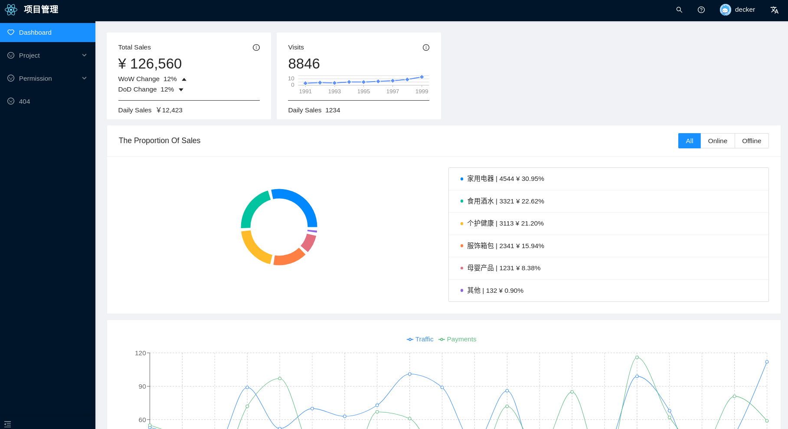
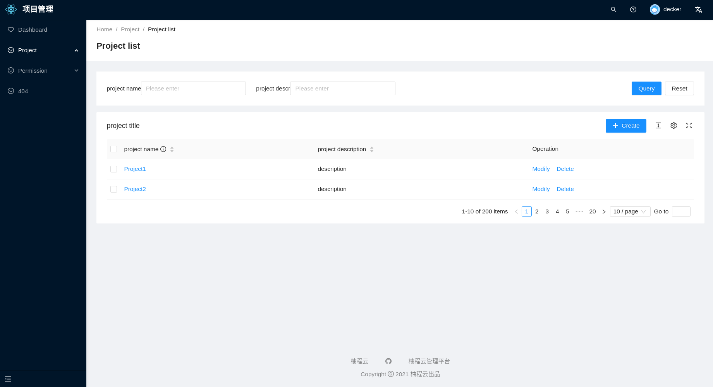

# 全新技术栈管理系统

全新技术栈的后台管理系统

- React
- Recoil
- React Query
- React Hooks
- Vite
- Typescript

## [Document](./README.md)


## 截图





## 安装使用

- 获取项目代码

```
 git clone https://github.com/ychengcloud/react-vite-admin.git
 ```

- 安装依赖

```
 cd react-vite-admin
 ```

```
 yarn install
 ```

- 运行

```
 yarn dev
 ```

- 打包

```
 yarn build
 ```

## 如何贡献

非常欢迎你的加入！提一个 Issue 或者提交一个 Pull Request。[查看如何操作](./contributing.md).

## 致谢

本项目的产生离不开下列优秀项目给予的灵感和代码

- [Antd Design](https://ant.design)
- [Antd Design Pro](https://pro.ant.design/)
- [Vite](https://vitejs.dev/)
- [React Query](https://react-query.tanstack.com/)
- [React antd admin](https://github.com/WinmezzZ/react-antd-admin.git)
- [vue-vben-admin](https://github.com/anncwb/vue-vben-admin)

如有遗漏，欢迎指正和补充。

## 声明

本项目旨在学习采用最新技术栈实现一个后台管理系统，不建议在生产环境下使用，仅供学习参考之用，本人不负责使用本项目产生的任何问题。

## License

[MIT](./LICENSE)